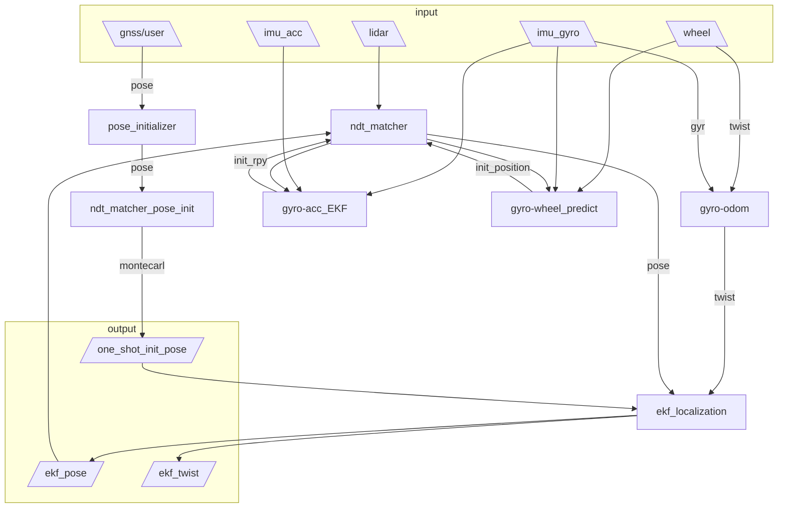
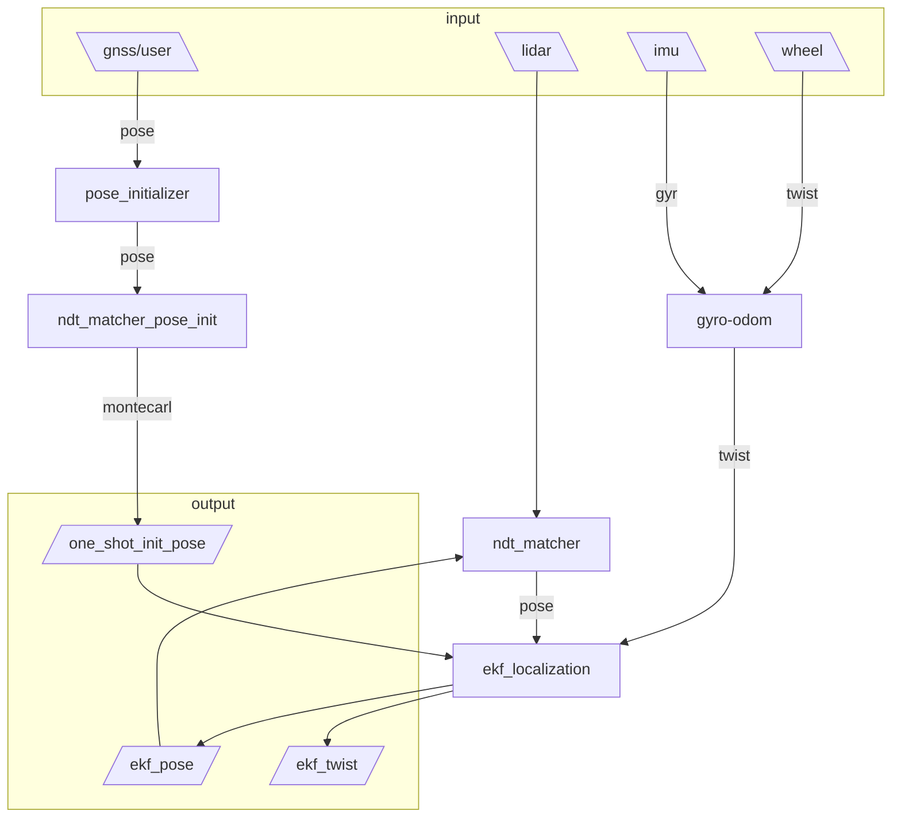

# base on autoware localization frame




# raw autoware localization frame



# use

## set pcd map path
const std::string kMapPath = "/home/dyf/rosbag_0827_imu_wheel_vanjee_南风楼/map.pcd";
- [ndt_matcher](/src/ndt_matcher/src/ndt_matcher.cpp)

## set map pub path
pub once only for watch point cloud map
- [ndt_matcher](/src/ndt_matcher/src/pcd_publisher_node.cpp)

## launch
``` bash
ros2 launch ndt_matcher ndt_launch.py
```
## pub map
``` bash
ros2 run ndt_matcher pcd_publisher_node
```

# rosbag 
``` bash
ros2 bag play rosbag_0827_imu_wheel_vanjee_南风楼/rosbag2_2024_08_27-19_42_33/
```
